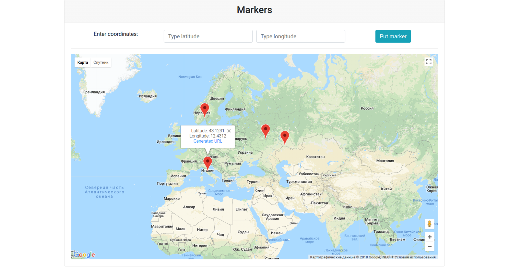

# Markers app

Simple app, where you can put a marker on the google map by typing coordinates (latitude and longitude)

Demo: [Markers](http://google-map-markers.herokuapp.com/)

---
### First, install all gems:

`bundle install`

### Second, setup database and migrations

`rails db:setup && rails db:migrate`

### Last, start the server

`rails server`

Go to http://localhost:3000
